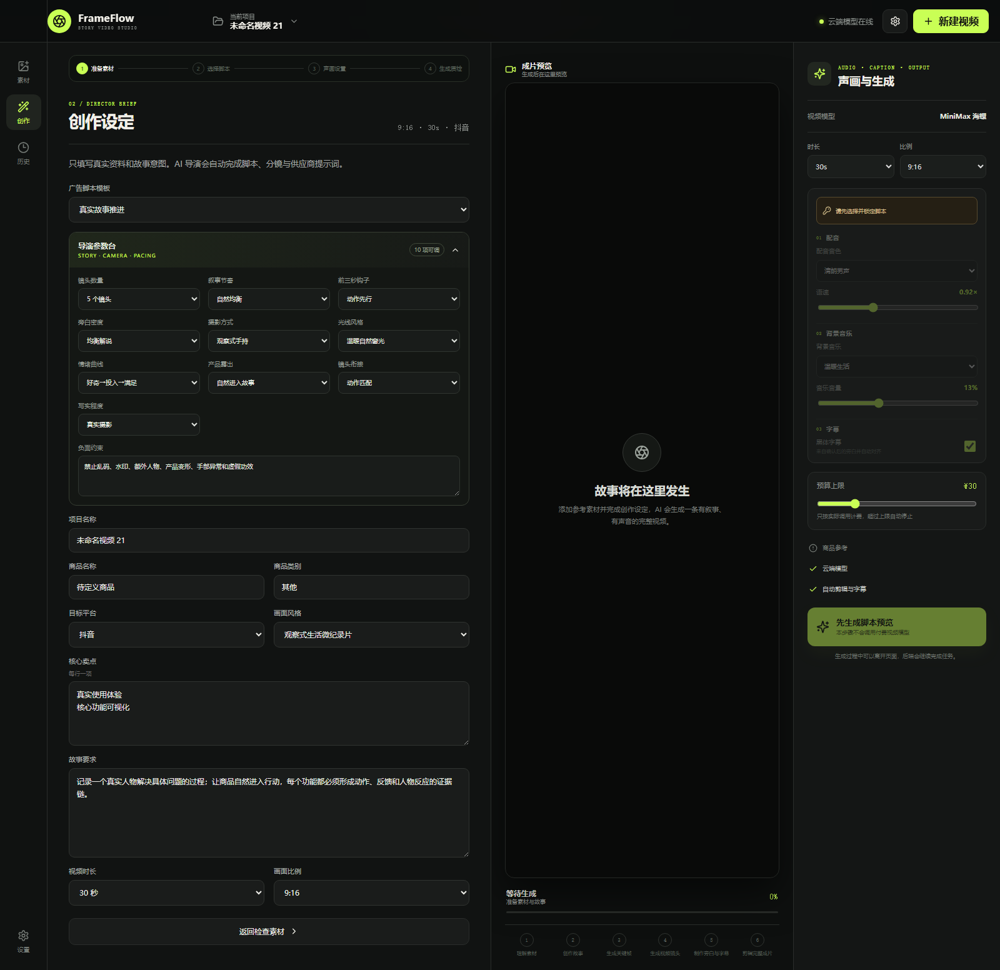
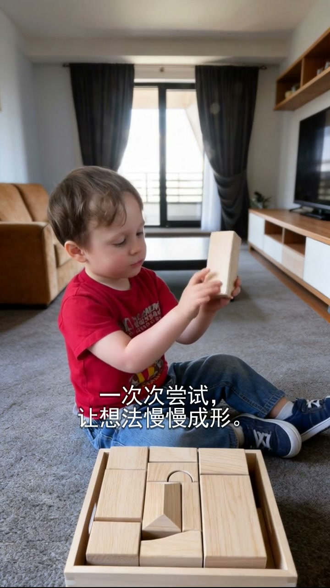
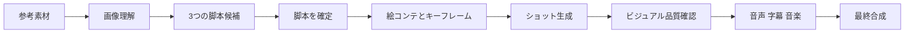

# FrameFlow

**商品リファレンスから、ストーリー性のあるレビュー可能な広告動画を制作する AI ビデオスタジオ。**

[简体中文](README.zh-CN.md) · [English](README.md) · **日本語**



FrameFlow は、クリエイティブ判断と有料動画生成を分離します。素材を準備し、複数の脚本を比較して方向性を確定した後、音声・音楽を設定し、ショット単位の生成、品質確認、最終合成を行います。

## デモ

[](examples/media/wooden-blocks-demo.mp4)

▶ [15 秒の生成動画を見る](examples/media/wooden-blocks-demo.mp4) · [キーフレームと構造化サンプルを見る](examples/README.md)

公開デモは架空の商品を使用しており、顧客素材や認証情報は含まれていません。

## 主な特徴

- **生成前に脚本を選択**：3 つの案を比較し、確定後に有料動画モデルを呼び出します。
- **リファレンス優先**：商品、人物、背景、ブランド素材を視覚的制約として管理します。
- **詳細な演出設定**：テンポ、ショット数、フック、カメラ、照明、感情、トランジションを調整できます。
- **ショット単位の再生成**：失敗した箇所だけを修復し、全体の再生成を避けます。
- **クラウド AI**：Qwen/DashScope による企画・画像理解・レビューと、MiniMax/Seedance 互換ルートによる動画生成。
- **一体型ポストプロダクション**：ナレーション、字幕、BGM、効果音、ロゴ、CTA、FFmpeg 合成。

## ワークフロー



## Windows クイックスタート

Python 3.12+ と `PATH` に登録された FFmpeg が必要です。

1. リポジトリをダウンロードまたはクローンします。
2. `启动FrameFlow.bat` をダブルクリックします。
3. 初回の依存関係インストールを待ちます。
4. ブラウザが開かない場合は `http://127.0.0.1:8000` にアクセスします。
5. 設定画面で自身のクラウド API Key を入力します。

キーはローカルの `backend/.env` にのみ保存され、Git には含まれません。

## 開発環境

```powershell
python -m pip install -r backend/requirements.txt
cd frontend
npm install
npm run build
cd ..
python -m uvicorn backend.app.main:app --host 127.0.0.1 --port 8000
```

詳細は[アーキテクチャ](docs/ARCHITECTURE.md)、[API 戦略](docs/LOW_COST_API_STRATEGY.md)、[ストーリー動画パイプライン](docs/STORY_VIDEO_PIPELINE_RESEARCH.md)を参照してください。

## セキュリティ

- `backend/.env` や API Key をコミットしないでください。
- 権利を保有、または使用許可を得た素材のみを使用してください。
- 識別可能な人物、特に子どもの素材には適切な同意が必要です。
- 商用公開前に、生成された商品説明を人が確認してください。

脆弱性の報告方法は [SECURITY.md](SECURITY.md) を参照してください。
