# FrameFlow

**A story-first AI commercial video studio for turning product references into coherent, reviewable video campaigns.**

[简体中文](README.zh-CN.md) · **English** · [日本語](README.ja.md)


## Studio interface


FrameFlow is an end-to-end workflow for product video creation. It separates creative decisions from paid generation: prepare assets, compare multiple scripts, lock a direction, configure voice and music, generate shots, review visual consistency, and compose the final film.

## Demo

[](examples/media/wooden-blocks-demo.mp4)

▶ [Watch the 15-second generated demo](examples/media/wooden-blocks-demo.mp4) · [Browse keyframes and structured examples](examples/README.md)

The public demo is a fictional technical sample. It contains no customer assets or credentials.

## Why FrameFlow

- **Script before spend** — generate and compare three creative directions before calling a paid video model.
- **Reference-first generation** — product, character, scene, and brand assets become explicit visual constraints.
- **Director controls** — tune pacing, shot count, hook, camera, lighting, emotion, exposure, transitions, and negative constraints.
- **Shot-level recovery** — retry only a failed keyframe or clip instead of regenerating the whole campaign.
- **Cloud-native AI** — use Qwen/DashScope for planning and visual review, with MiniMax or Seedance-compatible video routes.
- **Complete post-production** — narration, subtitles, BGM, SFX, logo, CTA, FFmpeg composition, and optional enhancement.

## Workflow

```mermaid
flowchart LR
  A[Reference assets] --> B[Visual analysis]
  B --> C[Three script candidates]
  C --> D[Human script lock]
  D --> E[Storyboard and keyframes]
  E --> F[Shot generation]
  F --> G[Visual quality review]
  G --> H[Voice, subtitles and music]
  H --> I[FFmpeg final composition]
```



## Quick start on Windows

Requirements: Python 3.12+ and FFmpeg available on `PATH`.

1. Download or clone the repository.
2. Double-click `启动FrameFlow.bat`.
3. Wait for the first-run dependency installation.
4. Open `http://127.0.0.1:8000` if the browser does not open automatically.
5. Configure your own cloud API keys in the setup screen.

API keys are stored only in local `backend/.env`, which is excluded from Git.

## Developer setup

```powershell
python -m pip install -r backend/requirements.txt
cd frontend
npm install
npm run build
cd ..
python -m uvicorn backend.app.main:app --host 127.0.0.1 --port 8000
```

## Architecture

| Layer | Technology | Responsibility |
|---|---|---|
| Studio | React + TypeScript + Vite | Assets, script selection, director controls, production status |
| API | FastAPI + Pydantic | Projects, schemas, setup, orchestration, budget gates |
| Creative intelligence | Qwen / OpenAI-compatible APIs | Vision analysis, script planning, prompt construction, review |
| Video providers | MiniMax / Seedance-compatible adapters | Keyframes and short video clips |
| Post-production | FFmpeg + optional Real-ESRGAN | Narration, captions, music, SFX, logo, CTA, assembly |
| Persistence | Local JSON boundary | Portable personal-studio storage; replaceable with PostgreSQL |

See [Architecture](docs/ARCHITECTURE.md), [API strategy](docs/LOW_COST_API_STRATEGY.md), and [story pipeline research](docs/STORY_VIDEO_PIPELINE_RESEARCH.md).

## Repository structure

```text
backend/app/       FastAPI application and generation pipeline
frontend/src/      React studio source
frontend/dist/     Prebuilt customer UI
examples/          Public demo, screenshots, scripts, and storyboard data
docs/              Product architecture and deployment strategy
scripts/           Customer launcher and speech synthesis
remotion/          Optional motion-design integration
tools/             Optional local post-processing runtime
```

## Security and responsible use

- Never commit `backend/.env` or provider credentials.
- Use only assets you own or are authorized to process.
- Obtain appropriate consent for identifiable people, especially children.
- Generated claims must be verified before commercial publication.
- Visual review reduces risk but does not replace human approval.

See [SECURITY.md](SECURITY.md) for vulnerability reporting and deployment guidance.

## Status

FrameFlow is a personal-studio and integration reference build. Before multi-user production deployment, add authentication, tenant isolation, durable queues, object storage, database-backed billing, signed webhooks, and a formal content moderation policy.
