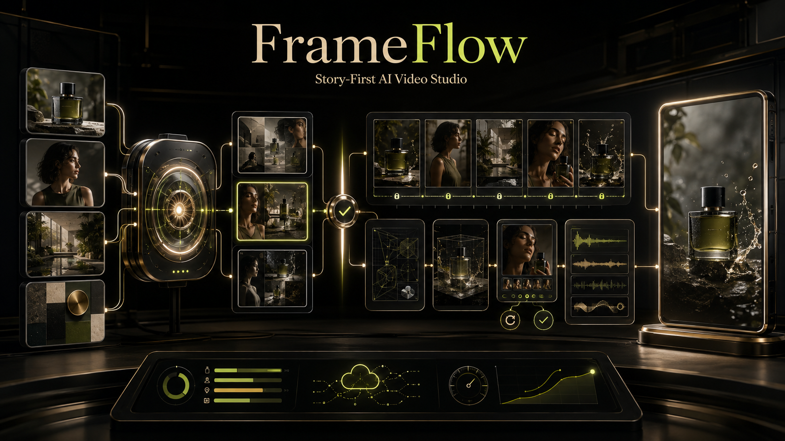
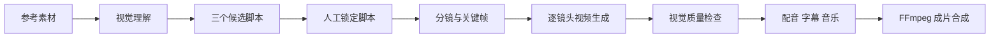

# FrameFlow

**一套以故事为先、可审查、可局部重做的 AI 商业视频生成工作室。**

**简体中文** · [English](README.md) · [日本語](README.ja.md)



## 创作界面


FrameFlow 将商品参考素材转换为结构清晰的广告视频。系统把创作决策放在付费生成之前：准备素材、比较多个脚本、锁定方向、设置配音与音乐、逐镜头生成、视觉质检，最后统一合成成片。

## 演示

[](examples/media/wooden-blocks-demo.mp4)

▶ [观看 15 秒 AI 生成样片](examples/media/wooden-blocks-demo.mp4) · [查看关键帧、候选脚本和分镜数据](examples/README.md)

公开样片使用虚构商品，仅用于技术演示，不包含客户素材或密钥。

## 核心能力

- **先选脚本，再花费生成**：一次生成三个创作方向，用户锁定后才进入付费视频节点。
- **素材事实优先**：商品、人物、场景和 Logo 成为跨镜头视觉约束。
- **导演参数可控**：节奏、镜头数量、钩子、摄影、光线、情绪、产品露出、转场和负面约束均可配置。
- **局部失败恢复**：只重做失败关键帧或镜头，不必整条视频重新生成。
- **云端模型工作流**：Qwen/百炼负责视觉理解、脚本和审核，MiniMax 或 Seedance 兼容路由负责视频。
- **完整后期**：旁白、黑体字幕、BGM、音效、Logo、CTA、FFmpeg 合成与可选清晰度增强。

## 业务流程



## Windows 快速启动

### 推荐：免 Python 的 EXE 版本

从 GitHub Releases 下载 `FrameFlow-Windows-x64` 压缩包，完整解压后双击 `FrameFlow.exe`。程序会自动寻找 8000–8010 范围内的可用端口并打开浏览器。便携包已包含 Python 运行时、前端、预置素材和 FFmpeg；API Key 仍由用户在首次打开后的设置页填写，并且只保存在本机。

请勿只复制单独的 EXE；`_internal`、`frontend`、`backend` 和 `ffmpeg-bin` 文件夹必须与它放在同一目录。

### 源码版本

环境要求：Python 3.12+，并确保 FFmpeg 已加入 `PATH`。

1. 下载或克隆仓库。
2. 双击 `启动FrameFlow.bat`。
3. 首次启动等待后端依赖自动安装。
4. 如果浏览器没有自动打开，访问 `http://127.0.0.1:8000`。
5. 在前端设置页填写您自己的云端 API Key。

API Key 只保存在本机 `backend/.env`，该文件已被 Git 忽略。

## 开发方式启动

```powershell
python -m pip install -r backend/requirements.txt
cd frontend
npm install
npm run build
cd ..
python -m uvicorn backend.app.main:app --host 127.0.0.1 --port 8000
```

## 技术架构

| 层级 | 技术 | 职责 |
|---|---|---|
| 创作工作台 | React + TypeScript + Vite | 素材、脚本选择、导演参数、生产状态 |
| 业务接口 | FastAPI + Pydantic | 项目、Schema、配置、编排和预算门控 |
| 创作智能 | Qwen / OpenAI 兼容接口 | 视觉分析、脚本、提示词和自动复审 |
| 视频供应商 | MiniMax / Seedance 兼容适配器 | 关键帧与短视频镜头 |
| 后期系统 | FFmpeg + 可选 Real-ESRGAN | 旁白、字幕、音乐、音效、Logo、CTA 与合成 |
| 持久化 | 本地 JSON 边界 | 适合个人工作室，可替换为 PostgreSQL |

详细内容请查看[系统架构](docs/ARCHITECTURE.md)、[低成本 API 策略](docs/LOW_COST_API_STRATEGY.md)和[故事视频流水线研究](docs/STORY_VIDEO_PIPELINE_RESEARCH.md)。

## 安全与合规

- 不要提交 `backend/.env` 或任何供应商密钥。
- 仅使用拥有版权或获得授权的素材。
- 可识别人物尤其是儿童素材，应取得适当授权。
- 商业发布前必须人工核验生成的产品宣称。
- 自动视觉审核用于降低风险，不能替代最终人工批准。

更多信息见 [SECURITY.md](SECURITY.md)。

## 当前定位

当前版本适合个人视频工作室、产品演示和 API 集成验证。若用于多用户正式生产，还需要加入登录鉴权、租户隔离、持久任务队列、对象存储、数据库计费、Webhook 签名与正式内容审核策略。
