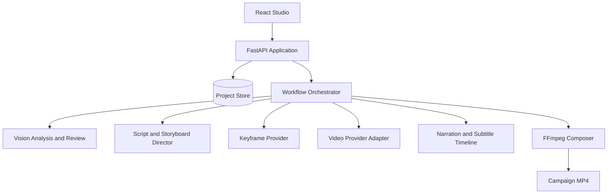

# FrameFlow Architecture

FrameFlow is organized around a durable project record and a resumable, shot-level workflow. Paid generation nodes are separated from free planning and local post-production nodes.

## Core boundaries

### Project and facts

`Project`, `Asset`, `BrandBible`, `CreativePlan`, and `Shot` are Pydantic contracts. The Brand Bible contains approved visual facts and blocks conflicting plans before billable nodes.

### Workflow orchestration

Each keyframe and video shot is an independent node with dependencies, attempts, estimated and actual cost, provider metadata, outputs, and quality decisions. A failed node can be retried without invalidating completed siblings.

### Provider adapters

Cloud APIs are accessed behind provider interfaces. The current customer build supports MiniMax-first routing and a Seedance-compatible path, while text and vision use OpenAI-compatible endpoints such as DashScope.

### Review

Keyframes are reviewed for product, character, and scene identity. Sampled video frames are reviewed for motion continuity, hand physics, screen direction, blank screens, unwanted text, and watermarks. Automated decisions may pause the workflow; they do not silently spend money on retries.

### Post-production

The final composer normalizes clips and assembles narration, deterministic subtitles derived from the locked voiceover, music, sound effects, feature-state overlays, logo, and CTA. Text and brand marks are added in post rather than generated inside video frames.

## Production evolution

The included JSON store is suitable for a personal studio. A multi-user deployment should replace it with PostgreSQL, move execution to a durable task queue, store media in object storage, add tenant authentication and billing reservations, and validate signed provider webhooks.
