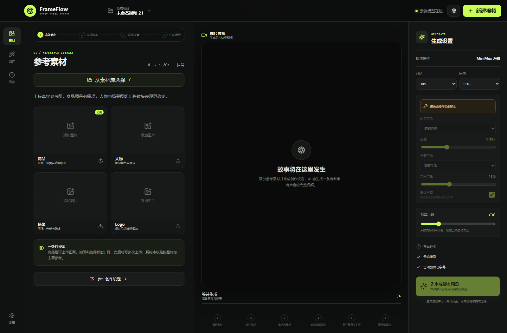

# FrameFlow 示例

这里提供一组可以安全公开的演示资料，用于理解 FrameFlow 从素材准备到脚本锁定、声画设置和视频生产的业务流程。示例不包含真实客户素材、API Key 或付费模型输出。

## 界面示例

### 创作工作台

### 导演参数台与声画设置

导演参数会真实进入脚本与镜头提示词，包括镜头数量、叙事节奏、前三秒钩子、摄影方式、光线、情绪曲线、产品露出、转场和负面约束。

## 数据示例

- [示例项目配置](sample-project.json)
- [示例候选脚本](sample-script-candidates.json)
- [示例五镜头分镜](sample-storyboard.json)

推荐操作顺序：

1. 上传或从素材库选择商品、人物、场景与 Logo。
2. 填写真实产品资料和导演参数。
3. 生成三个脚本候选并锁定其中一个。
4. 设置音色、语速、背景音乐、音量与字幕。
5. 确认预算后进入关键帧、视频、质检和合成流程。

> 示例中的产品与文案均为虚构，仅用于技术演示。
